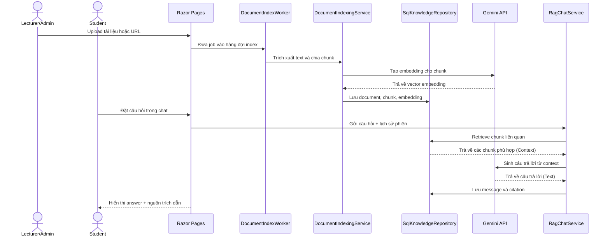
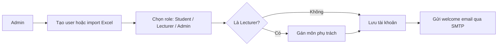
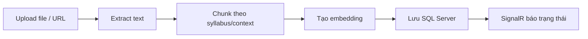
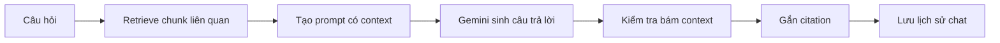

# EduVietRAG - Course Document Assistant

EduVietRAG là web app ASP.NET Core Razor Pages hỗ trợ quản lý tài liệu môn học và hỏi đáp theo mô hình RAG (Retrieval-Augmented Generation). Hệ thống cho phép giảng viên tải lên tài liệu, tự động trích xuất nội dung, chia đoạn, tạo embedding, sau đó sinh viên có thể đặt câu hỏi và nhận câu trả lời có trích dẫn nguồn.

> Mục tiêu chính: câu trả lời phải bám vào tài liệu đã index, có citation rõ ràng, hạn chế trả lời ngoài phạm vi dữ liệu của môn học.

## Mục Lục

- [Tính năng chính](#tính-năng-chính)
- [Kiến trúc hệ thống](#kiến-trúc-hệ-thống)
- [Cấu trúc source code](#cấu-trúc-source-code)
- [Phân quyền người dùng](#phân-quyền-người-dùng)
- [Luồng nghiệp vụ](#luồng-nghiệp-vụ)
- [Cấu hình môi trường](#cấu-hình-môi-trường)
- [Hướng dẫn chạy project](#hướng-dẫn-chạy-project)
- [Hướng dẫn sử dụng](#hướng-dẫn-sử-dụng)
- [Kiểm thử](#kiểm-thử)
- [Lưu ý vận hành](#lưu-ý-vận-hành)

## Tính Năng Chính

| Nhóm chức năng | Mô tả |
|---|---|
| Xác thực | Đăng nhập bằng tài khoản nội bộ, hỗ trợ Google OAuth khi cấu hình client id/secret. |
| Quản trị người dùng | Admin tạo tài khoản, import Excel, đổi role, gán môn cho lecturer, gửi email welcome qua SMTP. |
| Quản lý môn học | Seed sẵn danh mục môn, tạo thêm môn, gán môn cho giảng viên phụ trách. |
| Quản lý tài liệu | Upload tài liệu PDF, DOCX, PPTX, TXT hoặc lấy nội dung từ URL. |
| Index tài liệu | Trích xuất text, chia chunk theo ngữ cảnh syllabus, tạo embedding, lưu vào SQL Server. |
| Chat RAG | Hỏi đáp theo phiên chat, truy xuất chunk liên quan, sinh câu trả lời từ context và lưu lịch sử. |
| Citation | Câu trả lời kèm nguồn tài liệu/chunk để người dùng kiểm tra lại. |
| Realtime status | SignalR cập nhật trạng thái index tài liệu cho giao diện. |
| Kiểm thử | Có test project riêng cho chunking, retrieval, embedding, indexing và RAG service. |

## Kiến Trúc Hệ Thống


Sơ đồ trên thể hiện đúng các lớp chính của hệ thống: Presentation Layer xử lý Razor Pages, tài khoản và realtime status; BAL/ServicesLayer xử lý nghiệp vụ RAG, chunking, embedding và index tài liệu; Data Access Layer làm việc với repository, mapper, DbContext và SQL Server; các dịch vụ ngoài gồm Gemini API, Google OAuth và SMTP.

### Luồng RAG Tóm Tắt



## Cấu Trúc Source Code

```text
C:\Assignment2
|-- Group7_SE1950.sln
|-- README.md
|-- DataAccessLayer/
|   |-- Context/                  # EF Core DbContext và factory
|   |-- Entities/                 # Entity SQL cho document, chunk, chat, subject...
|   |-- Enums/                    # Role, status, file type, message role...
|   |-- Mapping/                  # Mapper entity <-> model nghiệp vụ
|   |-- Repositories/             # SqlKnowledgeRepository
|   |-- Schema/                   # Tự tạo/cập nhật schema và seed catalog môn học
|   |-- IKnowledgeRepository.cs   # Contract truy cập dữ liệu RAG
|   `-- DataAccessLayer.csproj
|-- ServicesLayer/
|   |-- DocumentIndexingService.cs        # Pipeline upload/index tài liệu
|   |-- DocumentIndexJobQueue.cs          # Hàng đợi index background
|   |-- DocumentTextExtractor.cs          # Extract PDF/DOCX/PPTX/TXT
|   |-- WebPageTextExtractor.cs           # Extract nội dung URL
|   |-- TextChunker.cs                    # Chunking thường và FLM syllabus-aware
|   |-- EmbeddingService.cs               # Hashing fallback embedding
|   |-- GeminiEmbeddingService.cs         # Embedding qua Gemini
|   |-- GeminiChatCompletionService.cs    # Chat completion qua Gemini
|   |-- ChunkRetrievalEnrichmentService.cs
|   |-- RagChatService.cs                 # Orchestrator hỏi đáp RAG
|   `-- ServicesLayer.csproj
|-- PresentationLayer/
|   |-- Pages/
|   |   |-- Account/              # Login, Google callback, đổi/quên/reset password
|   |   |-- Admin/                # Quản trị user, role, subject, import Excel
|   |   |-- Home/                 # Chat, courses, documents, preview, online users
|   |   `-- Shared/               # Layout và partial view
|   |-- Hubs/                     # SignalR hub cập nhật trạng thái document
|   |-- Models/                   # ViewModel cho account, admin, home
|   |-- Security/                 # AppRoles và AuthorizationPolicies
|   |-- Services/                 # User store, SMTP sender, worker, notifier
|   |-- wwwroot/                  # CSS, JS, fonts, images, client libraries
|   |-- Program.cs                # DI, auth, SignalR, hosted service, routing
|   `-- Group07MVC.csproj
|-- ServicesLayer.Tests/
|   |-- *Tests.cs                 # Unit/integration tests cho service layer
|   `-- ServicesLayer.Tests.csproj
`-- TestData/
    `-- qa-test-50-vi-q-a.txt     # Bộ câu hỏi/đáp án kiểm thử thủ công
```

## Phân Quyền Người Dùng

Hệ thống có 3 role chính, được định nghĩa trong `PresentationLayer/Security/AppRoles.cs`.

| Role | Quyền truy cập | Ghi chú nghiệp vụ |
|---|---|---|
| Student | Chat, xem phiên chat, tạo/đổi tên/ghim/xóa phiên chat, xem chính sách trả lời. | Không được upload/quản lý tài liệu. Mặc định dùng toàn bộ tài liệu đã index theo phạm vi app hiện tại. |
| Lecturer | Toàn bộ quyền chat + quản lý tài liệu/môn được phụ trách. | Có thể upload tài liệu, xem document, preview, chỉnh sửa metadata, quản lý workspace môn học. |
| Admin | Toàn quyền Lecturer + trang Admin. | Tạo/import user, đổi role, gán môn cho lecturer, tạo subject, quản lý danh mục tài khoản. |

### Policy Trong Code

| Policy | Role được phép | Dùng cho |
|---|---|---|
| `ChatAccess` | Student, Lecturer, Admin | Các trang chat, course workspace, privacy/answer policy. |
| `DocumentRead` | Lecturer, Admin | Đọc tài liệu nếu cần policy tách riêng. |
| `DocumentManagement` | Lecturer, Admin | Upload, xem, preview, sửa, quản lý tài liệu. |
| `AdminOnly` | Admin | Trang `/Admin/Index`. |

### Quy Tắc Tài Khoản

- Người dùng không tự đăng ký. Trang Register sẽ chuyển về Login và báo liên hệ Nhà trường để được cấp tài khoản.
- Admin seed được tạo tự động nếu `SeedAdmin.Enabled = true` và database chưa có admin hợp lệ.
- Không được hạ quyền hoặc xóa seed admin.
- Không được xóa admin trực tiếp; cần đổi role về Student/Lecturer trước nếu nghiệp vụ cho phép.
- Google OAuth chỉ đăng nhập được khi đã cấu hình và email tồn tại/được cấp trong hệ thống theo luồng hiện tại.

## Luồng Nghiệp Vụ

### 1. Quản Trị Tài Khoản



### 2. Index Tài Liệu



### 3. Hỏi Đáp RAG



## Cấu Hình Môi Trường

### Yêu Cầu

- .NET SDK 9.x
- SQL Server LocalDB, Express, Developer hoặc instance SQL Server tương đương
- Gemini API key nếu dùng provider `Gemini`
- SMTP account nếu muốn gửi email welcome/reset password
- Google OAuth client nếu muốn bật đăng nhập Google

### File Cấu Hình Chính

`PresentationLayer/appsettings.json` chứa các nhóm cấu hình sau:

| Nhóm | Ý nghĩa |
|---|---|
| `ConnectionStrings:DefaultConnection` | Chuỗi kết nối SQL Server. |
| `SeedAdmin` | Tài khoản admin mặc định khi khởi tạo. |
| `Embedding` | Bật/tắt embedding, chọn provider `Gemini` hoặc fallback hashing. |
| `Gemini` | API key, model chat, model embedding, timeout, base URL. |
| `Smtp` | Host, port, SSL, email gửi, username, password. |
| `Authentication:Google` | Google client id và client secret. |

Khuyến nghị thực tế: không commit API key, OAuth secret, SMTP password hoặc mật khẩu database thật. Dùng User Secrets, biến môi trường hoặc file cấu hình riêng theo môi trường deploy.

Ví dụ cấu hình biến môi trường trên PowerShell:

```powershell
$env:Gemini__ApiKey="YOUR_GEMINI_API_KEY"
$env:ConnectionStrings__DefaultConnection="Server=localhost;Database=EduVietRAG;Trusted_Connection=True;TrustServerCertificate=True;MultipleActiveResultSets=True;"
```

## Hướng Dẫn Chạy Project

Chạy từ thư mục solution:

```powershell
cd C:\Assignment2
dotnet restore
dotnet build Group7_SE1950.sln
dotnet run --project PresentationLayer\Group07MVC.csproj --urls http://0.0.0.0:9999
```

Mở trình duyệt:

```text
http://localhost:9999
```

Máy khác trong cùng LAN có thể truy cập bằng IP máy chạy app:

```text
http://<IP-may-chay-app>:9999
```

Khi app khởi động, hệ thống sẽ:

1. Kết nối SQL Server theo `DefaultConnection`.
2. Tạo/bổ sung schema cần thiết nếu thiếu.
3. Seed danh mục môn mặc định.
4. Seed admin nếu cấu hình bật.
5. Khởi động hosted service xử lý hàng đợi index tài liệu.

## Hướng Dẫn Sử Dụng

### Admin

1. Đăng nhập bằng seed admin hoặc tài khoản admin đã có.
2. Vào trang Admin để quản lý người dùng.
3. Tạo tài khoản mới hoặc import Excel danh sách user.
4. Chọn role phù hợp: Student, Lecturer hoặc Admin.
5. Với Lecturer, gán môn phụ trách nếu có.
6. Kiểm tra SMTP nếu hệ thống không gửi được welcome email.

### Lecturer

1. Đăng nhập vào hệ thống.
2. Vào khu vực quản lý tài liệu/môn học.
3. Upload file PDF, DOCX, PPTX, TXT hoặc nhập URL cần index.
4. Chờ trạng thái index hoàn tất. SignalR sẽ cập nhật trạng thái trên giao diện.
5. Kiểm tra preview/document nếu cần xác nhận nội dung đã index đúng.
6. Dùng chat để kiểm thử câu trả lời trên tài liệu vừa đưa vào.

### Student

1. Đăng nhập bằng tài khoản được cấp.
2. Vào trang Chat.
3. Tạo phiên chat mới hoặc tiếp tục phiên cũ.
4. Đặt câu hỏi liên quan đến tài liệu môn học.
5. Kiểm tra citation để biết câu trả lời lấy từ tài liệu nào.
6. Nếu hệ thống báo không đủ dữ liệu, cần hỏi lại rõ hơn hoặc liên hệ lecturer/admin để bổ sung tài liệu.

## Kiểm Thử

Chạy toàn bộ test:

```powershell
dotnet test Group7_SE1950.sln
```

Các nhóm test hiện có:

| File test | Mục đích |
|---|---|
| `RagChatServiceTests.cs` | Kiểm thử luồng hỏi đáp RAG và citation. |
| `DocumentIndexingServiceTests.cs` | Kiểm thử upload/index tài liệu. |
| `DocumentAccessScopeTests.cs` | Kiểm thử phạm vi truy cập tài liệu. |
| `ParagraphAwareTextChunkerTests.cs` | Kiểm thử chunking theo đoạn. |
| `FlmSyllabusAwareTextChunkerTests.cs` | Kiểm thử chunking theo cấu trúc syllabus. |
| `GeminiEmbeddingServiceTests.cs` | Kiểm thử embedding service. |
| `CompatibleChatCompletionServiceTests.cs` | Kiểm thử adapter chat completion. |
| `AiChunkRetrievalEnrichmentServiceTests.cs` | Kiểm thử enrichment cho retrieval. |

Bộ câu hỏi/đáp án kiểm thử thủ công nằm ở:

```text
TestData/qa-test-50-vi-q-a.txt
```

## Lưu Ý Vận Hành

- Không đưa secret thật lên repository public.
- Sau khi đổi model embedding hoặc số chiều embedding, nên re-index tài liệu cũ để tránh lệch vector.
- Metadata như mã môn, chương, tên file chỉ hỗ trợ lọc/tăng hạng retrieval; không nên xem là bằng chứng trả lời nếu nội dung chunk không có dữ kiện.
- Câu trả lời học thuật phải có citation. Nếu không có chunk đủ căn cứ, hệ thống nên từ chối hoặc yêu cầu bổ sung tài liệu.
- Với Google OAuth, callback mặc định là `/signin-google`; cần cấu hình đúng redirect URI trên Google Cloud Console.
- Google sign-in bị ẩn khi truy cập bằng private IP LAN để tránh lỗi OAuth redirect không hợp lệ.
- SQL schema được tạo bằng `EnsureCreated` và các câu lệnh bổ sung cột/index. Nếu deploy production nghiêm túc, nên chuyển sang migration có kiểm soát.
- User account hiện được lưu trong bảng `app_users`, còn dữ liệu RAG dùng các bảng `rag_*`.

## Công Nghệ Sử Dụng

| Thành phần | Công nghệ |
|---|---|
| Web app | ASP.NET Core Razor Pages, .NET 9 |
| Auth | Cookie Authentication, Google OAuth |
| Realtime | SignalR |
| Database | SQL Server, EF Core SQL Server |
| AI | Gemini chat + embedding, hashing embedding fallback |
| Document parsing | OpenXML, PdfPig, text extractor nội bộ |
| Test | xUnit, Microsoft.NET.Test.Sdk, coverlet |
### Student

1. Đăng nhập bằng tài khoản được cấp.
2. Vào trang Chat.
3. Tạo phiên chat mới hoặc tiếp tục phiên cũ.
4. Đặt câu hỏi liên quan đến tài liệu môn học.
5. Kiểm tra citation để biết câu trả lời lấy từ tài liệu nào.
6. Nếu hệ thống báo không đủ dữ liệu, cần hỏi lại rõ hơn hoặc liên hệ lecturer/admin để bổ sung tài liệu.
