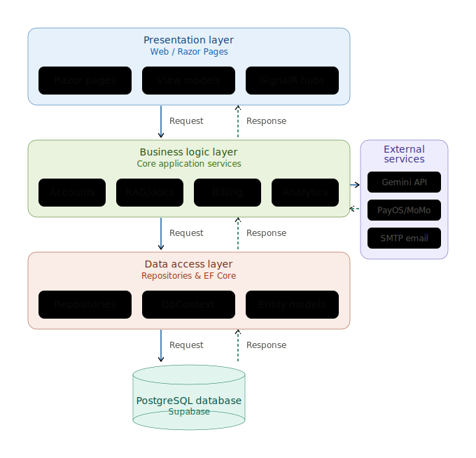
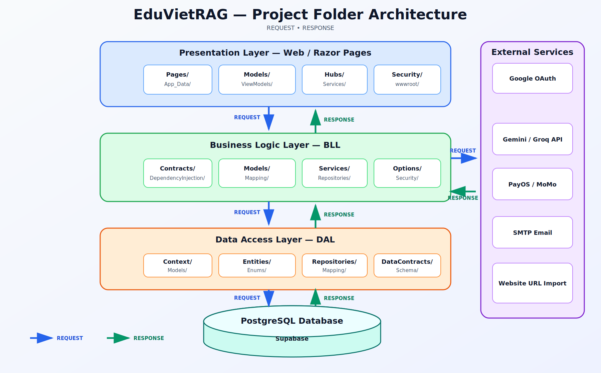
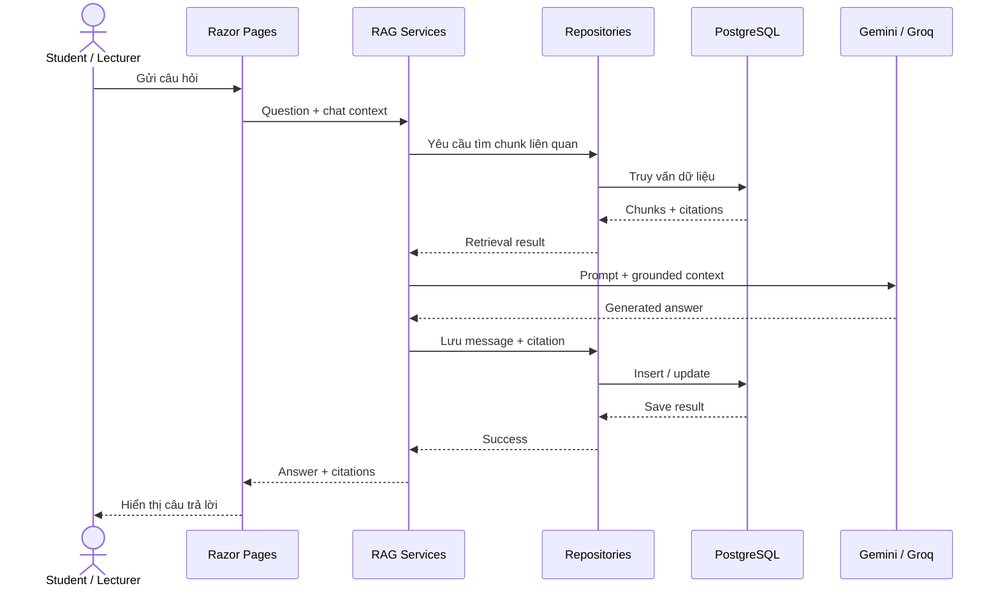

# EduVietRAG

<p align="center">
  <strong>Nền tảng quản lý tài liệu môn học và hỏi đáp có trích dẫn dựa trên RAG</strong>
</p>

<p align="center">
  <a href="https://github.com/thanhduykx/PRN222_FINAL/actions/workflows/dotnet.yml">
    
  </a>
  
  
  
  
</p>

EduVietRAG hỗ trợ giảng viên quản lý và index tài liệu môn học. Sinh viên có thể đặt câu hỏi trên nội dung đã index và nhận câu trả lời kèm citation để kiểm tra nguồn.

> Nguyên tắc chính: câu trả lời phải dựa trên tài liệu được truy xuất. Khi không đủ căn cứ, hệ thống cần thông báo thiếu dữ liệu thay vì tạo câu trả lời không được kiểm chứng.

## Mục lục

- [Tính năng](#tính-năng)
- [Kiến trúc](#kiến-trúc)
- [Cấu trúc dự án](#cấu-trúc-dự-án)
- [Luồng RAG](#luồng-rag)
- [Công nghệ](#công-nghệ)
- [Yêu cầu](#yêu-cầu)
- [Cài đặt và chạy](#cài-đặt-và-chạy)
- [Cấu hình](#cấu-hình)
- [Kiểm thử](#kiểm-thử)
- [Vai trò người dùng](#vai-trò-người-dùng)
- [Tài liệu bổ sung](#tài-liệu-bổ-sung)
- [Lưu ý bảo mật](#lưu-ý-bảo-mật)

## Tính năng

| Nhóm | Mô tả |
|---|---|
| Xác thực | Đăng nhập nội bộ, đổi/quên mật khẩu và Google OAuth |
| Quản lý người dùng | Tạo hoặc import tài khoản, phân quyền và gán môn học |
| Quản lý tài liệu | Upload PDF, DOCX, PPTX, TXT hoặc nhập nội dung từ URL công khai |
| Index tài liệu | Trích xuất văn bản, chia chunk, tạo embedding và lưu dữ liệu truy xuất |
| Chat RAG | Tìm ngữ cảnh liên quan, sinh câu trả lời và duy trì lịch sử hội thoại |
| Citation | Hiển thị tài liệu và chunk được dùng làm căn cứ trả lời |
| Quản lý môn học | Quản lý course, subject, workspace và quyền truy cập tài liệu |
| Realtime | SignalR cập nhật trạng thái index và người dùng trực tuyến |
| Gói dịch vụ | Quản lý package, subscription và thanh toán qua PayOS hoặc MoMo |
| Quản trị | AI settings, thống kê, thông báo hệ thống và quản lý giá gói |

## Kiến trúc

### Kiến trúc 3 lớp

<p align="center">
  
</p>

Chiều phụ thuộc bắt buộc:

```text
Web → BLL → DAL
```

| Layer | Trách nhiệm |
|---|---|
| `Web` | Razor Pages, binding request, authorization, ViewModel, SignalR và hiển thị giao diện |
| `BLL` | Validation, nghiệp vụ, orchestration, mapping và hợp đồng dữ liệu |
| `DAL` | PostgreSQL, EF Core, repository, filesystem, SMTP và HTTP transport |

Các quy tắc quan trọng:

- `Web` chỉ tham chiếu `BLL`, không gọi trực tiếp `DAL`.
- `BLL` tham chiếu `DAL` thông qua repository và data contract.
- `DAL` không tham chiếu ngược lên `BLL` hoặc `Web`.
- External services được BLL điều phối ở mức use case; chi tiết transport được đóng gói sau abstraction phù hợp.
- Quy tắc dependency được kiểm tra bằng [`scripts/verify-3-layer.ps1`](scripts/verify-3-layer.ps1).

### Kiến trúc thư mục và tích hợp

<p align="center">
  
</p>

- Mũi tên xanh dương: `REQUEST`.
- Mũi tên xanh lá: `RESPONSE`.
- External Services chỉ kết nối với Business Logic Layer trên sơ đồ.
- Data Access Layer chịu trách nhiệm lưu và đọc dữ liệu từ PostgreSQL/Supabase.

## Cấu trúc dự án

```text
PRN222_FINAL/
├── Web/                         # Presentation Layer
│   ├── Pages/                   # Razor Pages và PageModel
│   ├── Models/, ViewModels/     # Input model và dữ liệu dành cho UI
│   ├── Hubs/, Services/         # SignalR và background workers
│   ├── Security/                # Authorization policies
│   ├── wwwroot/                 # CSS, JavaScript và static assets
│   └── Program.cs               # Composition root
├── BLL/                         # Business Logic Layer
│   ├── Contracts/               # DTO và service contracts
│   ├── Models/, Mapping/        # Business models và mapping
│   ├── Services/                # Nghiệp vụ theo feature
│   ├── Options/                 # Strongly typed configuration
│   ├── Security/                # Role constants
│   └── DependencyInjection/     # Đăng ký business services
├── DAL/                         # Data Access Layer
│   ├── Context/                 # EF Core DbContext
│   ├── Entities/, Enums/        # Persistence entities
│   ├── Repositories/            # Database, file, HTTP và SMTP
│   ├── DataContracts/           # Raw persistence models
│   ├── Mapping/                 # Entity/data mapping
│   └── Schema/                  # Khởi tạo và cập nhật schema
├── BLL.Tests/                   # Unit tests
├── docs/                        # Tài liệu kỹ thuật và ảnh kiến trúc
├── scripts/                     # Architecture và release verification
├── .github/workflows/           # GitHub Actions
└── PRN222_FINAL.sln
```

## Luồng RAG



Quy trình index tài liệu:

```text
Upload file hoặc URL
  → Trích xuất văn bản
  → Chia chunk
  → Tạo embedding
  → Lưu PostgreSQL
  → Cập nhật trạng thái qua SignalR
```

## Công nghệ

| Thành phần | Công nghệ |
|---|---|
| Runtime | .NET 9 |
| Web | ASP.NET Core Razor Pages |
| Realtime | SignalR |
| Database | PostgreSQL, Supabase, EF Core, Npgsql |
| AI | Gemini/Groq chat completion, Gemini embedding |
| Authentication | Cookie Authentication, Google OAuth |
| Payment | PayOS, MoMo |
| Email | SMTP |
| Document parsing | OpenXML, PdfPig và text extractor nội bộ |
| Testing | xUnit, Microsoft.NET.Test.Sdk, coverlet |
| CI | GitHub Actions |

## Yêu cầu

- .NET SDK 9.x
- PostgreSQL hoặc Supabase project
- Gemini API key để tạo embedding và sử dụng Gemini chat
- Các thông tin SMTP, Google OAuth, PayOS hoặc MoMo nếu bật tính năng tương ứng

## Cài đặt và chạy

### 1. Clone repository

```powershell
git clone https://github.com/thanhduykx/PRN222_FINAL.git
cd PRN222_FINAL
```

### 2. Restore dependencies

```powershell
dotnet restore PRN222_FINAL.sln
```

### 3. Cấu hình secret tối thiểu

```powershell
dotnet user-secrets --project Web/Web.csproj set "ConnectionStrings:DefaultConnection" "<POSTGRES_CONNECTION_STRING>"
dotnet user-secrets --project Web/Web.csproj set "Gemini:ApiKey" "<GEMINI_API_KEY>"
```

### 4. Chạy ứng dụng

```powershell
dotnet run --project Web/Web.csproj --urls http://localhost:9999
```

Mở [http://localhost:9999](http://localhost:9999).

## Cấu hình

Ứng dụng đọc cấu hình từ `Web/appsettings.json`, .NET User Secrets và biến môi trường. Với cấu hình phân cấp, biến môi trường dùng dấu `__`, ví dụ `Gemini__ApiKey`.

| Nhóm cấu hình | Mục đích |
|---|---|
| `ConnectionStrings:DefaultConnection` | Kết nối PostgreSQL/Supabase |
| `SeedAdmin` | Tạo tài khoản quản trị ban đầu |
| `Embedding` | Bật/tắt embedding; cấu hình hiện tại sử dụng Gemini |
| `Gemini` | Model chat, embedding, endpoint và timeout |
| `Smtp` | Gửi email tài khoản và thông báo |
| `Authentication:Google` | Đăng nhập Google OAuth |
| `Payment:PayOS` | Thanh toán PayOS |
| `Payment:MoMo` | Thanh toán MoMo |

Ví dụ cấu hình thêm bằng User Secrets:

```powershell
dotnet user-secrets --project Web/Web.csproj set "Authentication:Google:ClientId" "<GOOGLE_CLIENT_ID>"
dotnet user-secrets --project Web/Web.csproj set "Authentication:Google:ClientSecret" "<GOOGLE_CLIENT_SECRET>"
dotnet user-secrets --project Web/Web.csproj set "Smtp:Password" "<SMTP_APP_PASSWORD>"
dotnet user-secrets --project Web/Web.csproj set "Payment:PayOS:ApiKey" "<PAYOS_API_KEY>"
dotnet user-secrets --project Web/Web.csproj set "Payment:MoMo:SecretKey" "<MOMO_SECRET_KEY>"
```

## Kiểm thử

### Chạy unit tests

```powershell
dotnet test BLL.Tests/BLL.Tests.csproj
```

### Kiểm tra dependency 3 lớp

```powershell
powershell -ExecutionPolicy Bypass -File scripts/verify-3-layer.ps1
```

### Chạy toàn bộ release gates

```powershell
powershell -ExecutionPolicy Bypass -File scripts/verify-chatbot.ps1
```

Script release gate sẽ:

1. Chạy toàn bộ tests với warning được xem là lỗi.
2. Build project `Web`.
3. Kiểm tra dependency `Web → BLL → DAL`.
4. Dọn thư mục build tạm sau khi hoàn thành.

GitHub Actions tự động restore, build và test khi push lên `main`, `Thanh-Duy` hoặc khi tạo pull request.

## Vai trò người dùng

| Role | Quyền chính |
|---|---|
| `Student` | Chat, quản lý phiên chat, xem citation và nội dung được cấp quyền |
| `Lecturer` | Quyền Student, quản lý môn học và tài liệu phụ trách |
| `Admin` | Quản lý tài khoản, role, package, AI settings, thống kê và thông báo |

## Tài liệu bổ sung

- [Cấu hình Groq](docs/groq-configuration.md)
- [Đánh giá logic nghiệp vụ toàn dự án](docs/full-project-business-logic-audit.md)
- [Nghiên cứu độ tin cậy của chatbot RAG](docs/chatbot-rag-reliability-research.md)
- [Nghiên cứu comparison và citation](docs/advanced-rag-comparison-citation-research.md)
- [Nghiên cứu RAG đa môn học](docs/rag-multi-course-intelligence-research.md)
- [Nghiên cứu quản lý giá package](docs/admin-package-pricing-research.md)

## Lưu ý bảo mật

Không commit các giá trị thật sau đây:

- Database connection string
- Gemini/Groq API key
- Google OAuth client secret
- SMTP password
- PayOS/MoMo secret
- Seed admin password dùng ngoài môi trường local

Trước khi public repository, cần kiểm tra `Web/appsettings.json`, thay các giá trị nhạy cảm bằng chuỗi rỗng hoặc placeholder và thu hồi mọi secret đã từng được commit. Việc xóa secret khỏi commit mới không làm secret biến mất khỏi lịch sử Git.

---

<p align="center">
  <strong>EduVietRAG</strong><br>
  Grounded answers. Verifiable sources.
</p>
